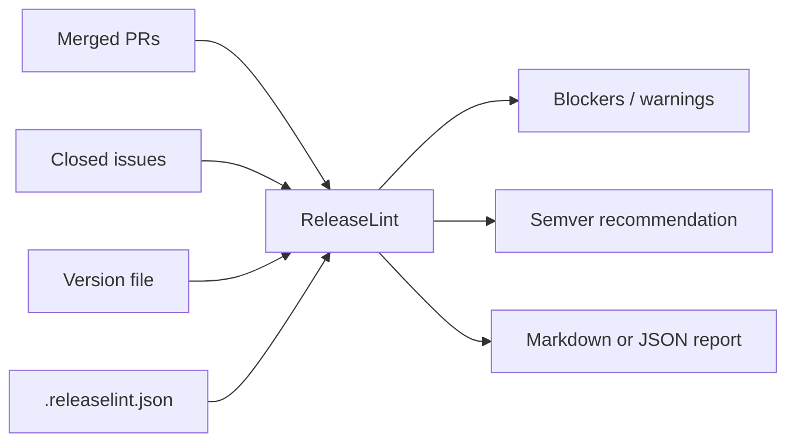

# ReleaseLint

[](https://www.npmjs.com/package/@vaibanbuilds/releaselint)
[](https://github.com/vaibanbuilds/releaselint/actions/workflows/ci.yml)
[](LICENSE)

[简体中文](README.zh-CN.md)

ReleaseLint is a release readiness linter for GitHub projects. It checks whether a release has enough evidence to ship before a maintainer cuts a tag.

It is not a release-note generator, an AI assistant, or an automatic publishing tool. ReleaseLint focuses on deterministic checks that can run in CI.

## Quick Demo

ReleaseLint turns GitHub release evidence into a CI-friendly readiness report:



### Ready release


Run the clean fixture:

```bash
npm run check:passing
```

### Release with blockers


Run a fixture with release-readiness problems:

```bash
npm run check
```

ReleaseLint will report blockers such as missing release labels or missing migration notes for breaking changes.

### Typical workflow

1. Add `.releaselint.json` to your repository.
2. Make sure pull requests use release labels such as `feature`, `fix`, `docs`, or `breaking-change`.
3. Run ReleaseLint locally or in GitHub Actions before cutting a release.
4. Fix blockers before publishing the tag.

## Why

Maintainers often need to answer the same questions before every release:

- Do merged pull requests have release labels?
- Do breaking changes include migration notes?
- Does the version bump match the merged work?
- Were issues closed with a traceable PR or commit?
- Can the release report explain why it passed or failed?

ReleaseLint turns those questions into a repeatable gate.

## Install

```bash
npm install -g @vaibanbuilds/releaselint
```

For local development from this repository:

```bash
npm install
npm run check
```

Create a starter config:

```bash
releaselint init
releaselint init --print
```

## Release Publishing

The repository includes a `Publish` workflow for npm releases. It runs when a `v*.*.*` tag is pushed and verifies that the tag matches `package.json` before publishing.

For npm trusted publishing, configure the package on npmjs.com with:

- Organization or user: `vaibanbuilds`
- Repository: `releaselint`
- Workflow filename: `publish.yml`
- Allowed action: `npm publish`

After that, maintainers can publish a release with:

```bash
git tag v0.1.4
git push origin v0.1.4
```

## CLI

```bash
releaselint check --repo owner/name --since-tag v1.2.0
```

Useful options:

```bash
releaselint check --repo owner/name --since-tag v1.2.0 --format json
releaselint check --fixture fixtures/sample-release.json
releaselint check --fixture fixtures/passing-release.json --version-file fixtures/package-v1.2.1.json
releaselint check --fixture fixtures/passing-release.json --version-file fixtures/pyproject.toml
releaselint check --fixture fixtures/passing-release.json --version-file fixtures/Cargo.toml
releaselint check --fixture fixtures/sample-release.json --annotations always
releaselint check --repo owner/name --since-tag v1.2.0 --no-fail
```

The repository includes two fixtures:

- `fixtures/sample-release.json` shows a release with blockers and warnings.
- `fixtures/passing-release.json` and `fixtures/package-v1.2.1.json` show a release that is ready to ship.
- `fixtures/pyproject.toml` and `fixtures/Cargo.toml` cover Python and Rust version files.

Set `GITHUB_TOKEN` to avoid GitHub API rate limits:

```bash
GITHUB_TOKEN=ghp_xxx releaselint check --repo owner/name --since-tag v1.2.0
```

## GitHub Action

For a copy-paste workflow, see [`examples/github-action`](examples/github-action).

When ReleaseLint runs in GitHub Actions, blockers are emitted as workflow errors and warnings are emitted as workflow warnings. Local CLI runs do not emit annotations unless `--annotations always` is used.

Set `comment: true` on `pull_request` workflows to post or update a single sticky Markdown report comment on the release PR. This is disabled by default and requires `issues: write` permission because GitHub stores pull request comments as issue comments.

```yaml
name: Release readiness

on:
  workflow_dispatch:
    inputs:
      since-tag:
        description: Base tag to check from
        required: true

jobs:
  releaselint:
    runs-on: ubuntu-latest
    permissions:
      contents: read
      pull-requests: read
      issues: read
    steps:
      - uses: actions/checkout@v4
      - uses: vaibanbuilds/releaselint@v0.1.4
        with:
          since-tag: ${{ inputs.since-tag }}
          version-file: package.json
```

For pull request comments:

```yaml
permissions:
  contents: read
  pull-requests: read
  issues: write

steps:
  - uses: actions/checkout@v4
  - uses: vaibanbuilds/releaselint@v0.1.4
    with:
      since-tag: v1.2.0
      comment: true
```

## Configuration

Create `.releaselint.json`:

```json
{
  "labels": {
    "major": ["breaking-change", "breaking"],
    "minor": ["feature", "feat", "enhancement"],
    "patch": ["bug", "bugfix", "fix"],
    "none": ["docs", "documentation", "chore", "internal", "test"]
  },
  "requirements": {
    "requireReleaseLabel": true,
    "requireMigrationNotesForBreaking": true,
    "requireLinkedIssueForClosedIssues": true,
    "requireConventionalCommits": true
  },
  "migrationNoteMarkers": ["migration", "breaking change", "upgrade notes"],
  "issueLinkPatterns": ["fixes #", "closes #", "resolves #"]
}
```

## Checks

ReleaseLint v0.1 checks:

- Merged PRs must have a release label.
- Breaking PRs must include migration notes.
- Non-merge commit messages should follow the conventional commit format.
- Release labels produce a `major`, `minor`, `patch`, or `none` bump recommendation.
- Local `package.json`, `pyproject.toml`, or `Cargo.toml` version should match the recommended bump when available.
- Closed issues should link to a PR or commit unless they are marked `no-code-change`, `invalid`, `duplicate`, or `wontfix`.

ReleaseLint detects linked issues from both issue bodies and merged pull request bodies, including markers such as `fixes #123`, `closes #123`, and `resolves #123`.

## GitHub Actions Annotations

ReleaseLint can emit workflow annotations:

```text
::error title=missing-release-label::PR #44 has no release label
::warning title=closed-issue-without-link::Issue #15 is closed without an obvious PR or commit link
```

Annotation modes:

- `auto`: emit annotations only when `GITHUB_ACTIONS=true`
- `always`: always emit annotations
- `never`: never emit annotations

## Design Principles

- Deterministic first: AI can help write notes later, but rules decide readiness.
- Evidence over prose: findings point back to PRs, issues, or commits.
- CI-friendly: non-zero exit codes can block a release workflow.
- Maintainer-owned: users run it with their own repository permissions and tokens.

## Roadmap

- Additional ecosystem version files
- Linked issue detection across commit messages
- Monorepo package selection
- Optional AI-assisted migration-note and release-note drafting

## License

MIT
