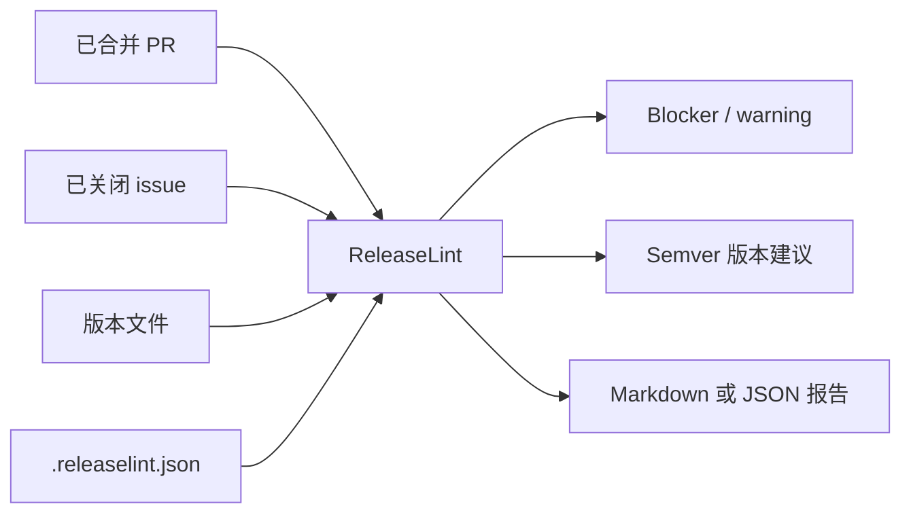
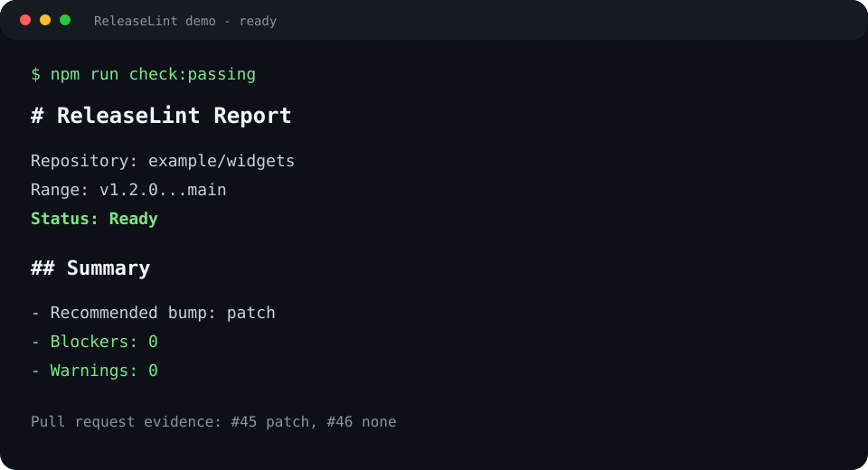
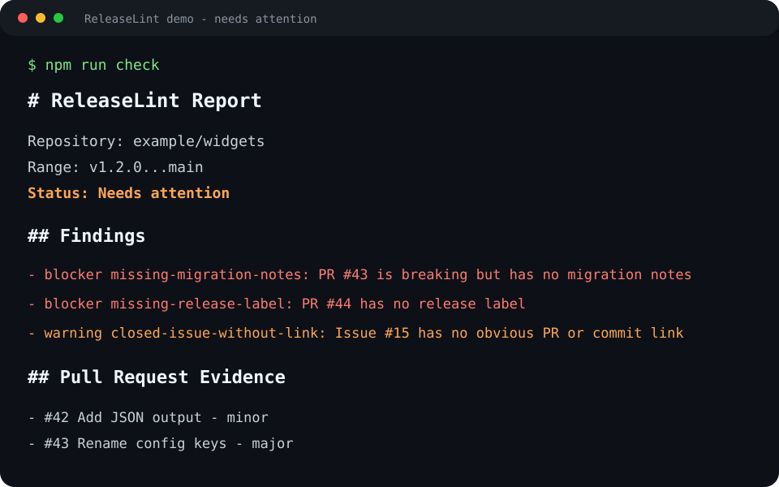

# ReleaseLint

[](https://www.npmjs.com/package/@vaibanbuilds/releaselint)
[](https://github.com/vaibanbuilds/releaselint/actions/workflows/ci.yml)
[](LICENSE)

[English](README.md)

ReleaseLint 是一个面向 GitHub 项目的发布就绪检查工具。它会在维护者发布新版本之前，检查这次发布是否具备足够的证据和规则约束。

它不是 release notes 生成器，也不是 AI 助手，更不是自动发版工具。ReleaseLint 专注于可重复、可审计、能在 CI 中运行的确定性检查。

## 快速演示

ReleaseLint 会把 GitHub 发版证据整理成适合 CI 使用的发布就绪报告：



### 可以发布的版本



运行通过示例：

```bash
npm run check:passing
```

### 存在发布风险的版本



运行一个包含发布风险的示例：

```bash
npm run check
```

ReleaseLint 会报告缺少 release label、breaking change 缺少迁移说明等 blocker。

### 典型使用流程

1. 在仓库中添加 `.releaselint.json`。
2. 给 PR 使用 `feature`、`fix`、`docs`、`breaking-change` 等 release label。
3. 在本地或 GitHub Actions 中运行 ReleaseLint。
4. 修复 blocker 后再发布 tag。

## 为什么需要它

开源维护者在每次发版前，经常需要回答这些问题：

- 已合并的 PR 是否都有 release label？
- 破坏性变更是否写了迁移说明？
- 当前版本号变更是否和已合并内容匹配？
- 已关闭的 issue 是否能追溯到 PR 或 commit？
- 发布报告能否解释为什么通过或失败？

ReleaseLint 把这些问题变成可以自动运行的发布门禁。

## 安装

```bash
npm install -g @vaibanbuilds/releaselint
```

如果你是从仓库本地开发：

```bash
npm install
npm run check
```

## CLI 用法

```bash
releaselint check --repo owner/name --since-tag v1.2.0
```

常用选项：

```bash
releaselint check --repo owner/name --since-tag v1.2.0 --format json
releaselint check --fixture fixtures/sample-release.json
releaselint check --fixture fixtures/passing-release.json --version-file fixtures/package-v1.2.1.json
releaselint check --repo owner/name --since-tag v1.2.0 --no-fail
```

仓库里包含两个 fixture：

- `fixtures/sample-release.json` 展示带有 blocker 和 warning 的发布。
- `fixtures/passing-release.json` 和 `fixtures/package-v1.2.1.json` 展示可以发布的通过示例。

建议设置 `GITHUB_TOKEN`，避免 GitHub API 速率限制：

```bash
GITHUB_TOKEN=ghp_xxx releaselint check --repo owner/name --since-tag v1.2.0
```

## GitHub Action

可以直接复制的 workflow 示例见 [`examples/github-action`](examples/github-action)。

```yaml
name: Release readiness

on:
  workflow_dispatch:
    inputs:
      since-tag:
        description: Base tag to check from
        required: true

jobs:
  releaselint:
    runs-on: ubuntu-latest
    permissions:
      contents: read
      pull-requests: read
      issues: read
    steps:
      - uses: actions/checkout@v4
      - uses: vaibanbuilds/releaselint@v0.1.1
        with:
          since-tag: ${{ inputs.since-tag }}
```

## 配置

创建 `.releaselint.json`：

```json
{
  "labels": {
    "major": ["breaking-change", "breaking"],
    "minor": ["feature", "feat", "enhancement"],
    "patch": ["bug", "bugfix", "fix"],
    "none": ["docs", "documentation", "chore", "internal", "test"]
  },
  "requirements": {
    "requireReleaseLabel": true,
    "requireMigrationNotesForBreaking": true,
    "requireLinkedIssueForClosedIssues": true
  },
  "migrationNoteMarkers": ["migration", "breaking change", "upgrade notes"],
  "issueLinkPatterns": ["fixes #", "closes #", "resolves #"]
}
```

## 当前检查项

ReleaseLint v0.1 会检查：

- 已合并 PR 必须有 release label。
- 标记为 breaking change 的 PR 必须包含迁移说明。
- release label 会推导出 `major`、`minor`、`patch` 或 `none` 的版本建议。
- 如果存在本地 `package.json`，版本号应与推荐版本变更匹配。
- 已关闭 issue 应该链接到 PR 或 commit，除非标记为 `no-code-change`、`invalid`、`duplicate` 或 `wontfix`。

ReleaseLint 会同时从 issue 正文和已合并 PR 正文中识别关联 issue，例如 `fixes #123`、`closes #123`、`resolves #123`。

## 设计原则

- 确定性优先：AI 可以在未来辅助撰写说明，但发布规则由确定性检查决定。
- 证据优先：每个问题都应能追溯到 PR、issue 或 commit。
- 适合 CI：发现 blocker 时可以用非零退出码阻断发布流程。
- 维护者自主管理：用户使用自己的仓库权限和 token 运行工具。

## 路线图

- 在 GitHub Action 中输出 annotations
- 在 release PR 中评论 Markdown 报告
- 支持更多版本文件格式
- 支持 monorepo 包选择
- 支持 conventional commit 检查
- 可选的 AI 辅助迁移说明和 release notes 草稿

## License

MIT
